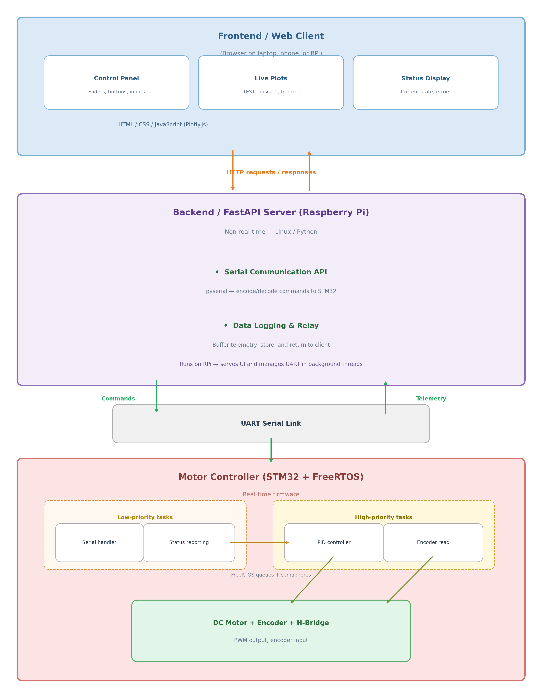
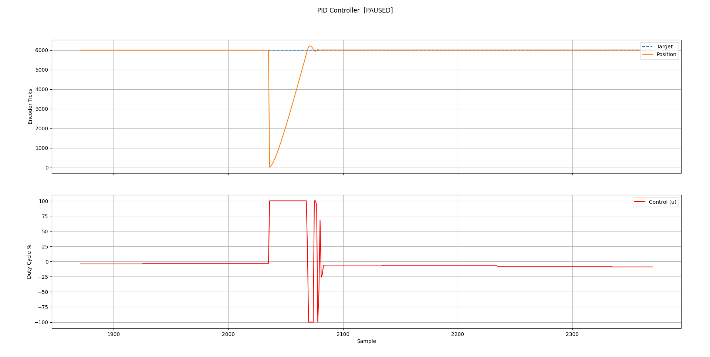

# Motor Control Using FreeRTOS
This project is an attempt to build a complete motion control system to support control of a brushed DC motor to start. It will include an interactive UI and plotting features, communication over UART to the STM32F401RE and firmware for motor control.

## Components used in this project:
1) Raspberry Pi SBC (Raspberry Pi 4 Model B)
2) STM32 MCU
3) INA219 Current Sensor
4) Brushed DC motor with encoder
5) H-bridge


## Software Architecture



### Using Cpp source file
The application code is written in cpp. The cpp_main() is executed for all the application logic. In order to avoid C++ mangling, the keyword ``` extern "C" ``` is used.
```#ifdef __cplusplus``` is used so that the C compiler ignores C++-only syntax (like class, extern "C", constructors, and member functions) that would cause compilation errors, since C doesn't understand any of these constructs.

## UI Development
The Raspberry Pi runs a backend using FastAPI Python framework.


## Low-level software configuration

### 1: Motor Encoder Configuration
The channel A and B of the quadrature are configured to the GPIO Pins PB6 and PB7 respectively. In CubeMX, PB6 GPIO mode is set to generate an interrupt on rising or falling edge(x2 decoding). Make sure to enable the EXTI line[9:5] in System Core NVIC settings. External Interrupt/Event Controller is a hardware block inside the STM32 that watches GPIO pins and generates an interrupt when it detects an edge (rising, falling, or both).

### 2: PWM Configuration

Basic PWM Generation using Timer
Configured Timer1 CH4 to generate a user defined duty cycle. The prescaler of the timer is set to 1MHz and the ARR register(max rollover counter) is set to 100.

Tpwm = ARR/Prescaler = 100/1MHZ = 100 microseconds. The frequency of the PWM is 10 kHZ.

### 3: Sending data to serial plotter python script using UART2

The printf function uses _sbrk(), meaning it uses malloc for buffering output. Since, this project
implements FreeRTOS using it's own memory allocation scheme, sysmem.c is disabled from build. For this reason, the ```uart_printf.cpp``` and ```uart_printf.hpp``` uses a custom printf function and putchar that is tweaked slighly from the microOS-riscv project.

va_list and related macros are defined in the C standard library <cstdarg>

### 4: Built a Basic PID controller for tracking position



[](https://www.youtube.com/watch?v=8RWqjpg8qiw)

The PID controller computes a control signal (duty cycle) to drive the motor to a target encoder position. The control signal is computed as:

```u = kp * e + ki * eint + kd * edert```

where `e = target - pos`, `eint` is the accumulated error over time, and `edert` is the rate of change of error.

**What each coefficient does:**
- **Kp (Proportional)** - Reacts to current error. Larger error = larger output. On its own, Kp cannot fully eliminate error because as the motor approaches the target, the output becomes too small to overcome motor friction. This remaining offset is called **steady-state error**.
- **Ki (Integral)** - Accumulates error over time. Even a tiny persistent error will eventually build up enough to push the motor past the friction threshold. Ki eliminates steady-state error. Too much Ki causes overshoot and oscillation (integral windup).
- **Kd (Derivative)** - Reacts to how fast the error is changing. Applies a braking force when the motor approaches the target quickly, reducing overshoot. Acts like a shock absorber. Too much Kd makes the system sluggish and amplifies sensor noise.

**Time measurement:** `getMicros()` is used because the PID loop runs very fast (sub-millisecond). Millisecond resolution would give `deltaT = 0` on many iterations, breaking the derivative and integral calculations. The time difference is converted to seconds so that PID gains stay in human-readable ranges consistent with standard tuning guides.

**Anti-windup:** The integral term `eint` is clamped to prevent unbounded accumulation when the output is saturated. Without this, the motor would overshoot badly after sustained error because `eint` takes a long time to unwind.

**Observation:** With a target of 6000 ticks, the motor settled at 6001 with `u = -25` and stopped changing. This is steady-state error caused by motor friction. The PID correctly computed a small negative output to correct the 1-tick overshoot, but -25% duty is below the motor's minimum threshold to physically move. DC motors have a minimum duty cycle needed to overcome internal friction (brush friction, gear friction, magnetic cogging). Below that threshold, the electrical energy dissipates as heat instead of producing rotation. Important thing to note is that there is no load attached to the shaft as of now.

### 4: Next Steps
1) Add a load to the shift
2) Finish error handling for different functions inside encoder and motor modules.
3) Create RTOS tasks to move PID controller to a fixed task instead of running in a while loop
4) Create low-priority tasks for updating UI elements(read encoder, status, etc)
5) Set-up communication between STM32 and RPI using UART

## FreeRTOS Configuration
This project includes the FreeRTOS kernel in the ThirdParty folder and does not use CMSIS RTOS API. This project does not use sysmem.c because FreeRTOS has its own heap management(make sure to check ThirdParty folder to not exclude from build and exclude sysmem.c from build). Also only heap_4.c is used.

```
    //Modified the preprocessor directive for gcc compiler in FreeRTOSConfig.h

    #if defined(__ICCARM__) || defined(__GNUC__) || defined(__CC_ARM)
        #include <stdint.h>
        extern uint32_t SystemCoreClock;
    #endif

```

FreeRTOS uses ARM Cortex-M processor's internal systick timer as its time base(RTOS ticking). HAL also uses the systick timer by default for HAL delay functions.
In order to prevent overriding each other's settings, the HAL is configured to use the TIM5 general purpose timer using CubeMX Sys configuration settings.


